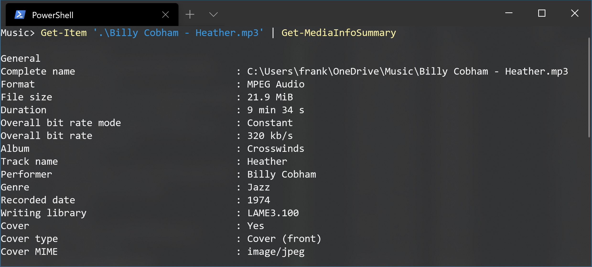

Get-MediaInfo
=============

Get-MediaInfo is a complete PowerShell MediaInfo solution.

It consists of three PowerShell advanced functions:

```PowerShell
Get-MediaInfo

Get-MediaInfoValue

Get-MediaInfoSummary
```




Installation
------------

Go to the release page and download the release. It contains one PS1 file and two DLL files, keep all three files in the same directory and load the PS1 file via [dot sourcing](https://docs.microsoft.com/en-us/powershell/module/microsoft.powershell.core/about/about_scripts?view=powershell-7#script-scope-and-dot-sourcing) into your profile.

On x86 replace MediaInfo.dll with the x86 version found on the [MediaInfo website](https://mediaarea.net/en/MediaInfo).


Get-MediaInfo
-------------

Converts media file objects into MediaInfo objects.

```
NAME
    Get-MediaInfo

SYNTAX
    Get-MediaInfo [[-Path] <string[]>] [-Video] [-Audio]  [<CommonParameters>]

ALIASES
    gmi
```


Description
-----------

Converts media file objects into MediaInfo objects.


Examples
--------

Displays media files of the defined folder using a grid view.

```PowerShell
Get-ChildItem 'D:\Samples' | Get-MediaInfo | Out-GridView
```


Same as above but using the current folder and aliases.

```PowerShell
gci | gmi | ogv
```


Find duplicates by comparing the duration.

```PowerShell
gci | gmi | select filename, duration, filesize | group duration | where { $_.count -gt 1 } | select -expand group | format-list
```


Parameters
----------

**-Path**

String array with audio or video files or FileInfo objects via pipeline.


**-Video**

Only video files will be processed.


**-Audio**

Only audio files will be processed.


Input
-----

String array with audio or video files as Path parameter or FileInfo objects via pipeline.


Output
------

MediaInfo objects.


Get-MediaInfoValue
==================

Returns specific properties from media files.

```
NAME
    Get-MediaInfoValue

SYNTAX
    Get-MediaInfoValue
        [-Path] <string>
        [-Kind] {General | Video | Audio | Text | Image | Menu}
        [[-Index] <int>]
        [-Parameter] <string>
        [<CommonParameters>]

ALIASES
    gmiv
```

Description
-----------

Returns specific properties from media files.


Examples
--------

Get the artist from a MP3 file.

```PowerShell
Get-MediaInfoValue '.\Meg Myers - Desire (Hucci Remix).mp3' -Kind General -Parameter Performer

Meg Myers
```


Get the channel count in a MP3 file. Return types are always strings und if necessary must be cast to integer.

```PowerShell
'.\Meg Myers - Desire (Hucci Remix).mp3' | Get-MediaInfoValue -Kind Audio -Parameter 'Channel(s)'

2
```


Get the language of the second audio stream in a movie.

The Index parameter is zero based.

```PowerShell
Get-MediaInfoValue '.\The Warriors.mkv' -Kind Audio -Index 1 -Parameter 'Language/String'

English
```


Get the count of subtitle streams in a movie.

```PowerShell
Get-MediaInfoValue '.\The Warriors.mkv' -Kind General -Parameter 'TextCount'

2
```


Parameters
----------

**-Path**

Path to a media file.


**-Kind** General | Video | Audio | Text | Image | Menu

A MediaInfo kind.

Kinds and their properties can be seen with [MediaInfo.NET](https://github.com/stax76/MediaInfo.NET).


**-Index**

Zero based stream number.


**-Parameter**

Name of the property to get.

The property names can be seen with [MediaInfo.NET](https://github.com/stax76/MediaInfo.NET) with following setting enabled:

Show parameter names as they are used in the MediaInfo API

They can also be seen with Get-MediaInfoSummary with the -Raw flag enabled.


Input
-----

Input can be defined with the Path parameter, pipe input supports a path as string or a FileInfo object.


Output
------

Output will always be of type string and must be cast to other types like integer if necessary.


Using the .NET class directly for highest performance
-----------------------------------------------------

To retrieve specific properties with highest possible performance the .NET class must be used directly:

```
$mi = New-Object MediaInfo -ArgumentList $Path
$value1 = $mi.GetInfo($Kind, $Index, $Parameter)
$value2 = $mi.GetInfo($Kind, $Index, $Parameter)
$mi.Dispose()
```

Get-MediaInfoSummary
--------------------

Shows a summary in text format for a media file.

```
NAME
    Get-MediaInfoSummary

SYNTAX
    Get-MediaInfoSummary [-Path] <string> [-Full] [-Raw]  [<CommonParameters>]

ALIASES
    gmis
```

Description
-----------

Shows a summary in text format for a media file.

Examples
--------

```PowerShell
 Get-MediaInfoSummary 'D:\Samples\Downton Abbey.mkv'
```

Parameters
----------

**-Path**

Path to a media file. Can also be passed via pipeline.


**-Full**

Show a extended summary.


**-Raw**

Show not the friendly parameter names but rather the names as they are used in the MediaInfo API.

Parameter names passed to Get-MediaInfoValue -Parameter must use the raw parameter name.


Input
-----

Path as string to a media file. Can also be passed via pipeline.


Output
------

A summary line by line as string array.
